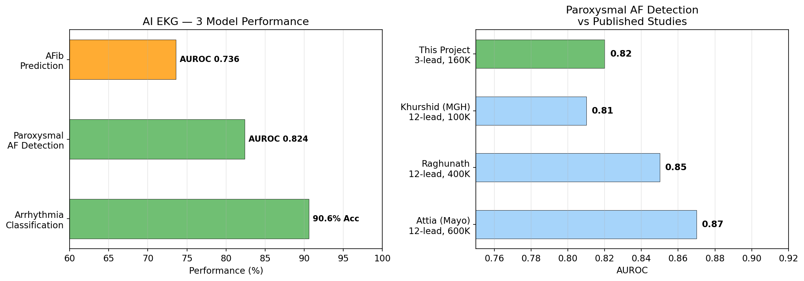
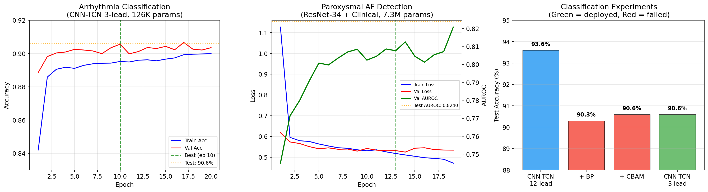
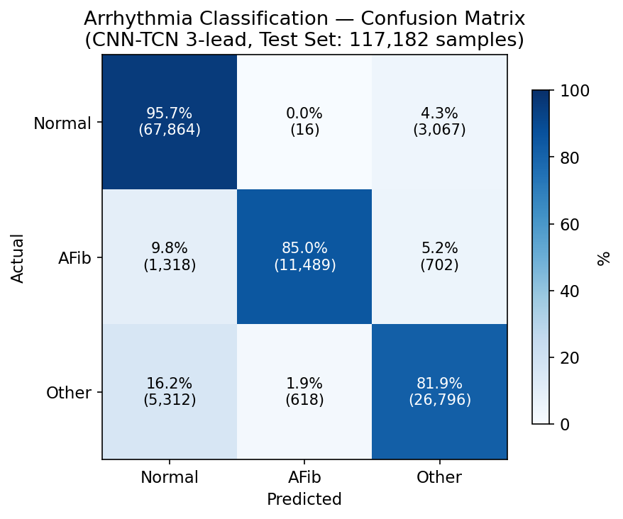

# AI-EKG

AI-powered 3-lead EKG measurement device — hardware to software, end-to-end.

## Overview

A personal/bedside EKG device built with ESP32 + ADS1292R, featuring AI-based cardiac analysis powered by models trained on MIMIC-IV ECG data (775K records, 160K patients).

### AI Features

| Feature | Model | Performance | Params |
|---------|-------|:-----------:|-------:|
| Arrhythmia Classification (Normal/AFib/Other) | CNN-TCN 3-lead | **90.6%** Accuracy | 126K |
| Paroxysmal AF Detection (hidden AF in sinus rhythm) | ResNet-34 + Clinical | **AUROC 0.824** | 7.3M |
| AFib Prediction (15-day risk from ECG sequence) | Sequence TCN | AUROC 0.736 | 145K |

### Results







### vs. Published Literature

| Study | Leads | Data | Task | AUROC |
|-------|:-----:|-----:|------|:-----:|
| Attia et al. (Mayo Clinic, 2019) | 12 | 600K patients | AF detection | 0.87 |
| Raghunath et al. (Geisinger, 2021) | 12 | 400K patients | AF prediction | 0.85 |
| Khurshid et al. (MGH, 2022) | 12 | 100K patients | 5-year AF | 0.81 |
| **This project** | **3** | **160K patients** | **AF detection** | **0.82** |

3-lead constraint with competitive AUROC — Lead II P-wave morphology alone enables meaningful AF analysis.

### Hardware

- **MCU**: ESP32-WROOM-32D
- **ADC**: ADS1292R (24-bit, 2-ch)
- **Display**: 5" SPI LCD (real-time waveform)
- **AI Server**: Raspberry Pi 5 (BLE connection)
- **Power**: USB 5V + Li-ion battery backup

## Development Journey

See [MODEL_DEVELOPMENT_JOURNEY.md](docs/MODEL_DEVELOPMENT_JOURNEY.md) for the full story of experiments, failures, and trade-offs behind these models — including 9 key compromises and lessons learned.

## Project Structure

```
ml/
  preprocessing/     # ECG signal processing pipeline
  model/             # Model architectures & training scripts
  visualize_results.py  # Generate performance charts
docs/
  project-plan-v1.0.md         # Full project plan (7-phase roadmap)
  ml_model_report.md           # Detailed ML experiment report
  MODEL_DEVELOPMENT_JOURNEY.md # Development story & trade-offs
  preprocessing-report.md      # Data pipeline documentation
  images/                      # Generated charts
scripts/             # MIMIC-IV database setup (SQL/shell)
references/          # Component surveys & datasheets
```

## ML Models

### 1. Arrhythmia Classification (CNN-TCN)
- 3-block CNN + 4-layer TCN + FC head
- Input: 3-lead ECG (10s, 500Hz) + numeric features + patient features
- 12-lead → 3-lead transition: 93.6% → 90.6% (3%p trade-off accepted)

### 2. Paroxysmal AF Detection (ResNet-34)
- ResNet-34 (1D Conv, from scratch) + Late Fusion with clinical flags
- Detects hidden AF substrate in normal-appearing sinus rhythm ECG
- Clinical features (DM, HF, MI, AHT) added +0.02 AUROC over ECG-only

### 3. AFib Prediction (Sequence TCN)
- CNN-TCN backbone → feature vectors → Temporal TCN over sequential ECGs
- Predicts rhythm abnormality within 15 days from serial measurements
- Single-measurement Recall 26%, but **cumulative 15-day Recall ~98%**

## Setup

### Prerequisites

- Python 3.10+
- PostgreSQL 16 (with MIMIC-IV data loaded)
- CUDA-compatible GPU (for training)

### Environment Variables

```bash
export DB_PASSWORD="your_postgres_password"
# Optional (defaults shown):
# export DB_HOST="localhost"
# export DB_PORT="5432"
# export DB_NAME="mimic4"
# export DB_USER="postgres"
```

### Install

```bash
python -m venv venv
source venv/bin/activate  # or venv\Scripts\activate on Windows
pip install -r requirements.txt
```

### Generate Charts

```bash
python ml/visualize_results.py
```

## Data

This project uses [MIMIC-IV](https://physionet.org/content/mimiciv/3.1/) and [MIMIC-IV-ECG](https://physionet.org/content/mimic-iv-ecg/1.0/) datasets. PhysioNet credentialed access is required.

## License

[MIT](LICENSE)
